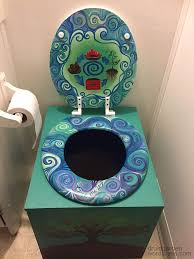

.. |A120| replace:: Golden Throne Composting Toilet A120

Introduction
##############

The |A120| is the latest model of our composting toilet. Its features include:

Portability
***********

At 10 lb and taking up only 8 gallons of spalce, you can easily take the |A120| with you to your parties and travels.

Off-grid
*********

With its innovative AeroStar process, the |A120| will compost your waste without the need for electricity or plumbing while minimizing odors.

Affordability
**************

Decades of research has lead to multiple refinements, including a simple and effective design that keeps the production costs low. You will be happy about the simple design and your wallet will be happy about not having to part with its friends.

API for Advanced Users
***********************

The |A120| comes with a powerful API written in Python that lets power users customize its maintenance schedule and indicator lights. 
For details, go to our `API site <http://goldenthrone.com/api>`.

Here is a code sample:

.. codeblock:: Python

	import golden_throne
	toilet = golden_throne.Toilet(id = 'asdx11')
	toilet.set_light('main', 'blue')

Reviews
*********

Please visit `Yelp <http://yelp.com>` for unbiased reviews of our products.

Questions
##############

Any questions can be sent to info@goldenthrone.com.